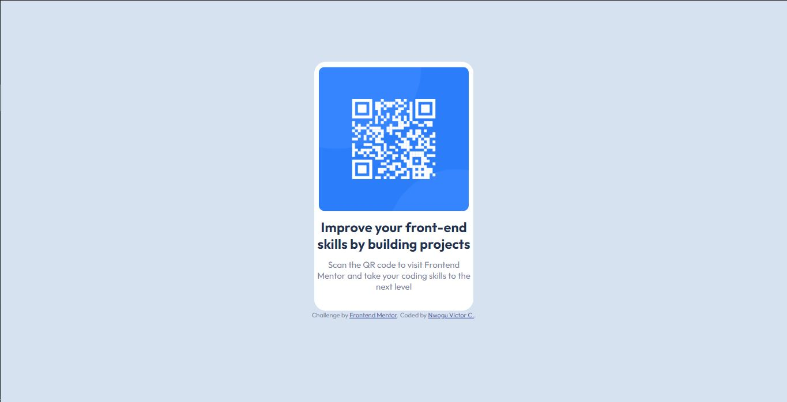
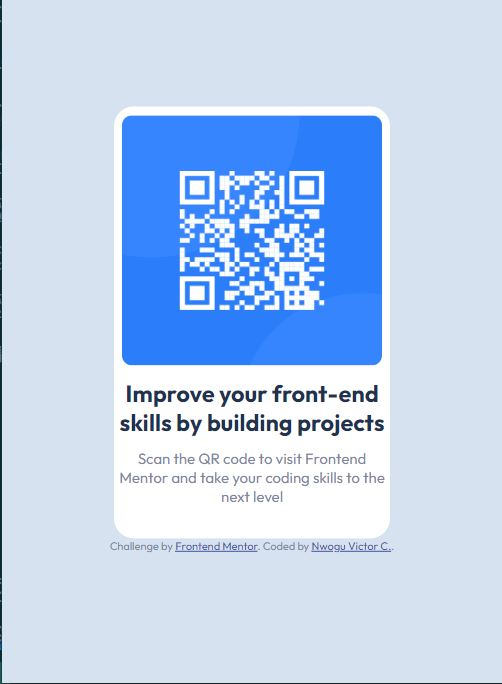

# Frontend Mentor - QR code component solution

This is a solution to the [QR code component challenge on Frontend Mentor](https://www.frontendmentor.io/challenges/qr-code-component-iux_sIO_H). Frontend Mentor challenges help you improve your coding skills by building realistic projects. 

## Table of contents

- [Overview](#overview)
  - [Screenshot](#screenshot)
  - [Links](#links)
- [My process](#my-process)
  - [Built with](#built-with)
  - [What I learned](#what-i-learned)
  - [Continued development](#continued-development)
  - [Useful resources](#useful-resources)
- [Author](#author)
- [Acknowledgments](#acknowledgments)

## Overview
Below is all you need to know about this basic project.
### Screenshot

The above are the links to the screenshots of my project in Desktop View and Mobile View.

### Links

- Solution URL: [Solution URL](https://github.com/J0k3s0nY0u/qr-code-component-main)
- Live Site URL: [live site URL](https://j0k3s0ny0u.github.io/qr-code-component-main/)

### My Process

### Built with

- Visual Studio Code HTML5 markup
- SCSS custom Styling
- CSS properties
- [Google Fonts](https://fonts.google.com/specimen/Outfit/) - Font Styles
- [Live SASS Compiler] - For styles

### What I learned

This project gave me a bit of nostalgia on how basic styles may prove to be challenging no matter how experienced you are. I had to refactor the code multiple times using different methods before I got a centralized image within its container div. It was fun stressful and surprisingly enjoyable. I recommend this project to anyone of any interest. No matter what level of expertise you're in, I assure you you'll enjoy it too.

### Continued development

I am still not comfortable with how I centralized the container div as well as its children. I will look up on centralizing objects more in response to future projects.

### Useful resources

- [Free Code Camp](https://www.freecodecamp.org/news/how-to-center-an-image-in-a-div-css/) - This helped me to centre the image and its container div. I really liked this pattern and will use it going forward.
- [Stack Overflow](https://stackoverflow.com/questions/30811779/keeping-a-div-the-same-size-no-matter-the-screen-resolution) - This is an amazing solution which helped me finally understand the necessity of different dimensions in web development. I'd recommend it to anyone still learning this concept.

## Author

- Website - [Nwogu Victor C.](Coming Soon!)
- Frontend Mentor - [@J0k3s0nY0u](https://www.frontendmentor.io/profile/J0k3s0nY0u)
- Github - [@J0k3s0nY0u](https://github.com/J0k3s0nY0u)

## Acknowledgments

I send my heartfelt regards to [@Sig-giovanni](https://github.com/Sig-giovanni) who gave me the advice to start up on Frontend Mentor. With his guidance and assistance in my professional upbringing, I assure you that your help would be rewarded someday.